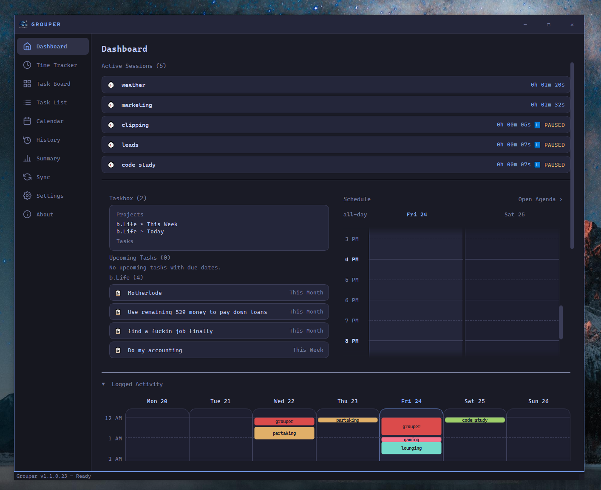
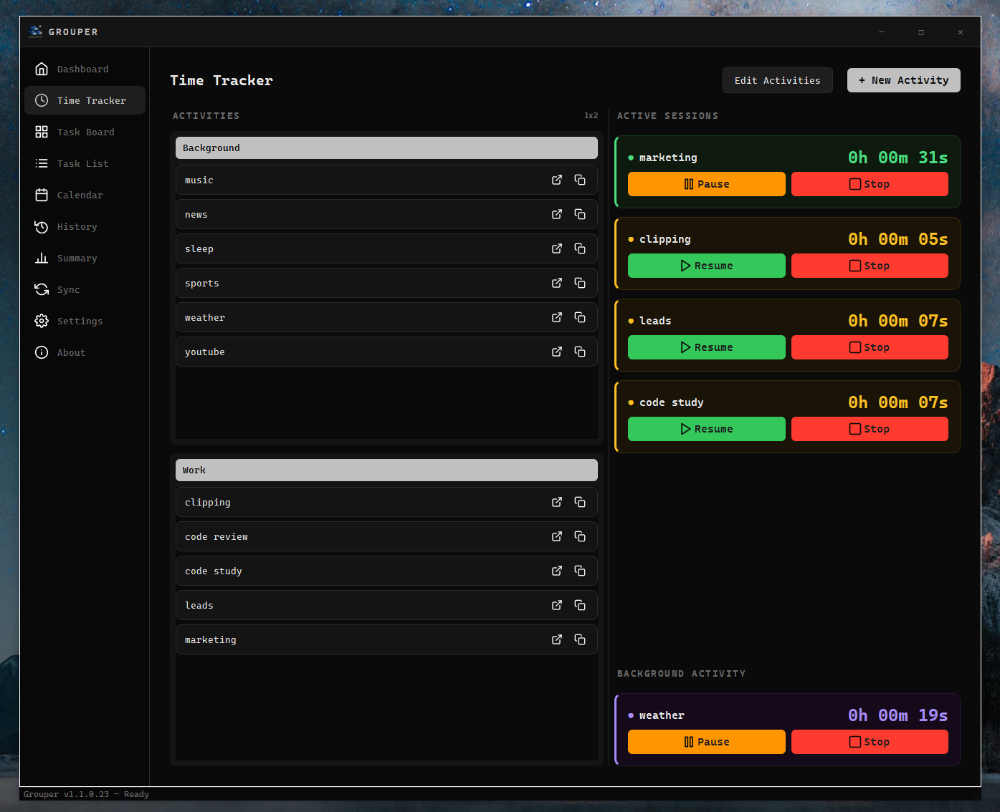
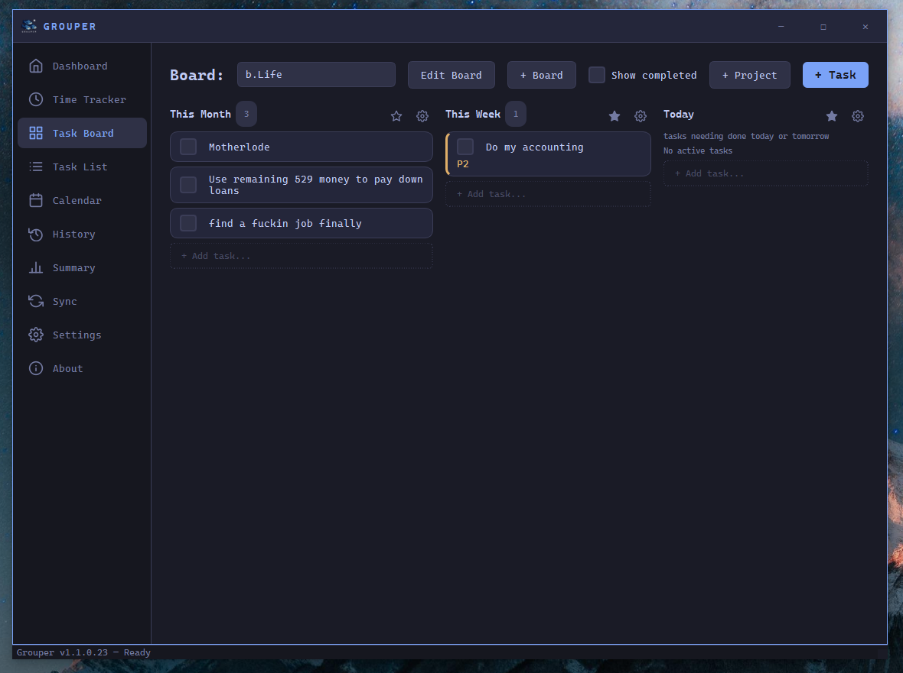
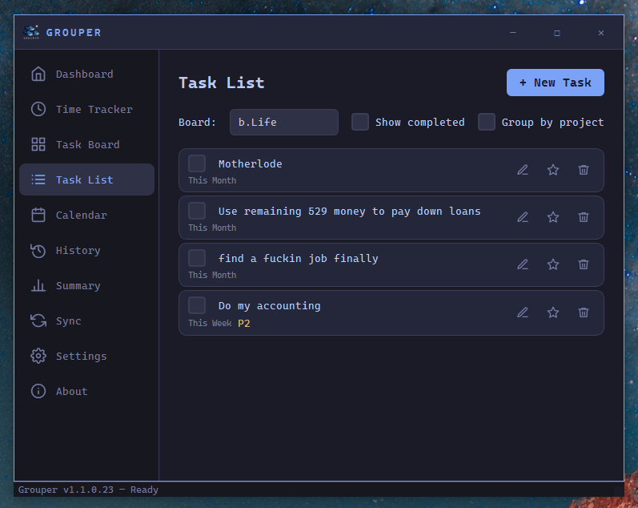
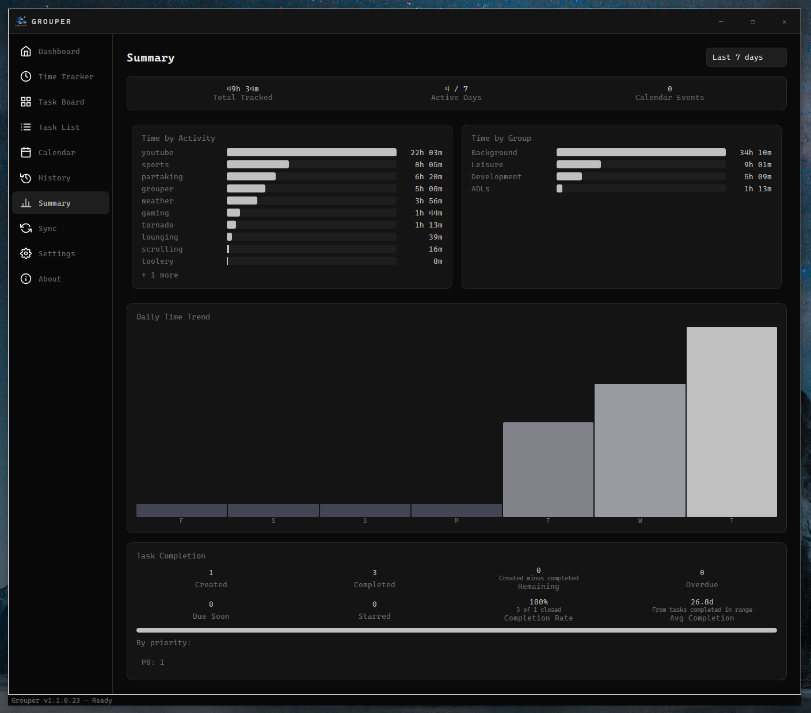

# Grouper

**A local productivity hub for time tracking and task management.**

---

## Installation

1. Download and unzip the release archive for your desired variant.
2. Run `setup.exe` from inside the unzipped folder.
3. If prompted by UAC, click **Yes** to allow administrator elevation (required for installing to `Program Files` and updating system PATH).
4. After installation, reopen any open terminals so they pick up the updated PATH.
5. Grouper will appear in **Settings > Apps > Installed apps** for uninstall.

### Release Variants

| Variant | Contents |
|---------|----------|
| `core` | Grouper desktop app only |
| `core_cli` | Desktop app + CLI tools |
| `core_server` | Desktop app + sync/web server |
| `core_cli_server` | Desktop app + CLI tools + sync/web server |

## Features

| | |
|---|---|
| **Time Tracker** |  |
| **Task Board** |  |
| **Task List** |  |
| **Summary** |  |

- **Time Tracker** — start/stop/pause sessions, tag them to tasks or activities
- **Task Board** — Kanban-style board with drag-and-drop columns
- **Task List** — flat list view with filtering and sorting
- **Calendar** — visualise sessions and deadlines by day/week/month
- **History** — browse every past session with search and filters
- **Summary** — aggregate stats: daily, weekly, and per-project breakdowns
- **Dashboard** — at-a-glance overview of today's work and upcoming tasks

## Data Storage

All data is stored locally in SQLite (`~/.grouper/grouper.db`). No cloud sync,
no accounts, no telemetry. Your data never leaves your machine.

Configuration is stored in `~/.grouper/config.json`. You can relocate the data
directory at any time from **Settings → Data → Move Data Directory**.

## Built With

## Contact & Support

- DM **@alvertremantel** on Threads
- Email: geosminjones@gmail.com
- Bug reports: https://github.com/alvertremantel/grouper/issues

---

*Grouper is independent software. It is not affiliated with Qt, Anthropic, or any other organisation whose tools it builds on.*
